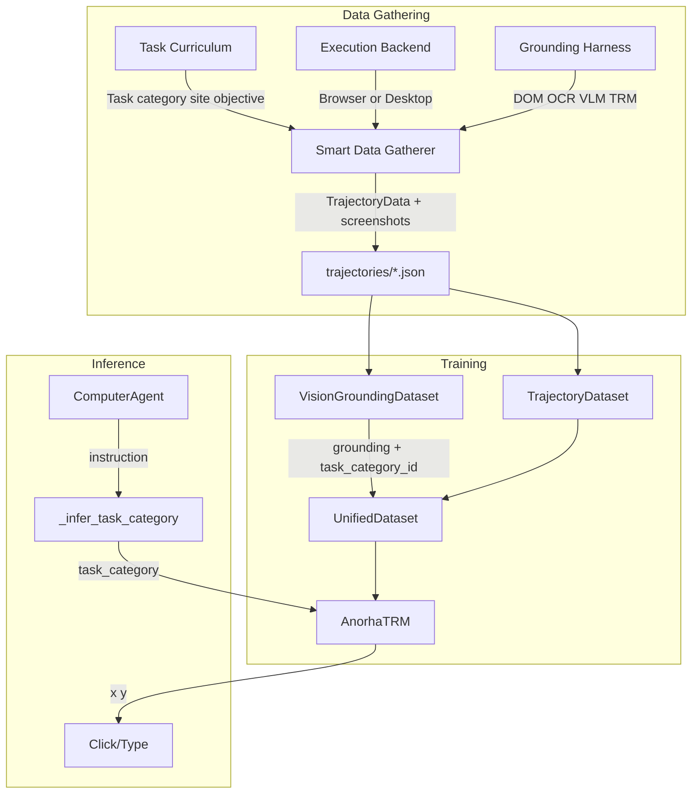

# Anorha Product: Impact on Data Gathering, Training, and Inference

This covers the full stack of recent changes: Grounding Harness, Execution Backend, Task Curriculum, Smart Data Gatherer, and Task Embeddings. The HRM transcript (Constantine/India) influenced the task embeddings: condensed task signals help in low-data regimes.

---

## Architecture Overview

---

## 1. Data Gathering

### Components

| Component               | Role                                                                                      |
| ----------------------- | ----------------------------------------------------------------------------------------- |
| **Task Curriculum**     | Tasks with category, difficulty, site, objective; sampled by backend (browser vs desktop) |
| **Execution Backend**   | BrowserBackend (Playwright) or DesktopBackend (pyautogui) for full computer use           |
| **Grounding Harness**   | Chain: DOM → OCR → OCR fuzzy → AnorhaTRM/VisionTRM/UGround/VLM → retry                    |
| **Smart Data Gatherer** | VLM-guided exploration, saves trajectories + screenshots + task_category                  |

### Cost

- **VLM:** Primary cost driver. Ollama local = free; cloud = per-token. Resize (`vlm_image_max_size`) reduces tokens.
- **Grounding:** DOM/OCR are free. AnorhaTRM/VisionTRM = local, free. UGround = ~2GB VRAM (4-bit). VLM fallback = extra VLM calls when TRM fails.
- **Execution:** Playwright/pyautogui = local, no API cost.
- **Task embeddings:** No extra cost; category from Task object.

### Speed

- **DOM:** Fastest, ~1–5 ms when elements available.
- **OCR:** Single pass, reused for exact + fuzzy + synonyms.
- **AnorhaTRM/VisionTRM:** ~10–50 ms per grounding (CNN forward).
- **VLM:** Slowest (seconds on CPU). Used only when DOM/OCR/TRM fail.
- **Timeout:** `grounding_timeout=30s` caps per-step grounding to fail fast.
- **Desktop vs Browser:** Desktop backend uses pyautogui; no browser startup. Browser adds ~5–10 s init.

### Ability

- **Multi-strategy grounding:** Target 97%+ success via fallbacks (DOM → OCR → TRM → VLM).
- **Browser + Desktop:** Supports web tasks and desktop (file explorer, downloads).
- **Task curriculum:** Structured tasks by category (precision, forms, navigation, etc.); diverse data.
- **Task category in data:** Richer training signal for task embeddings.

### Requirements

- **Ollama or llama.cpp** for VLM (moondream, llava, etc.).
- **Playwright** for browser backend.
- **pyautogui** for desktop backend (optional).
- **Torch** for AnorhaTRM/VisionTRM when used.
- `**--save-screenshots**` for Vision/Anorha TRM training data.
- `**--backend browser|desktop**` to choose execution mode.

---

## 2. Training

### Components

| Component                  | Role                                                                 |
| -------------------------- | -------------------------------------------------------------------- |
| **VisionGroundingDataset** | Loads trajectories with screenshot_path, target_label, task_category |
| **TrajectoryDataset**      | Mouse trajectory sequences for trajectory branch                     |
| **UnifiedDataset**         | Wraps both; grounding ratio controls mix                             |
| **AnorhaTRM**              | Grounding + trajectory in one model; task_embed conditions grounding |

### Cost

- **Hardware:** CPU works; GPU (~4GB+) speeds up. AnorhaTRM ~1–2M params, crap-top friendly.
- **Task embeddings:** +576 params (~0.02% of model).
- **Data:** Needs `--save-screenshots` trajectories. Target ~100k for good training.

### Speed

- **Vision augmentations:** Flip, brightness, contrast; ~5–10% slower per sample.
- **Task embedding:** ~0–1% slower; one int lookup per sample.
- **Grounding ratio:** 0.5 = half grounding, half trajectory steps per batch.

### Ability

- **Unified model:** One checkpoint for grounding + trajectory; simpler deployment.
- **Task conditioning:** Better disambiguation (e.g. "Submit" in forms vs search).
- **Backward compat:** Old trajectories without task_category map to index 8 (unknown).

### Requirements

- **Trajectories** with screenshot_path and target_label.
- **Retrain** if using task embeddings (old checkpoints lack task_embed).
- **PyTorch** + typical deps (PIL, tqdm, etc.).

---

## 3. Inference (Final Product)

### Components

| Component                 | Role                                                            |
| ------------------------- | --------------------------------------------------------------- |
| **ComputerAgent**         | High-level execute(); breaks task into steps                    |
| **Grounding Harness**     | Same chain as gatherer                                          |
| **AnorhaTRM / VisionTRM** | Local grounding; task_category from heuristic                   |
| **_infer_task_category**  | Keyword heuristic: "login" → forms, "search" → navigation, etc. |

### Cost

- **AnorhaTRM/VisionTRM:** Local, no API cost. Single forward pass per grounding.
- **VLM fallback:** Only when TRM fails; adds VLM cost.
- **Heuristic:** Free; ~10 substring checks.
- **Orchestrator LLM:** Optional (qwen3:4b via Ollama); local.

### Speed

- **Best case:** DOM match → ~5 ms.
- **OCR:** Single pass, reused; ~50–200 ms depending on engine.
- **AnorhaTRM:** ~20–50 ms per grounding (CNN).
- **VLM:** Slowest (seconds); used only on fallback.
- **Trajectory smoothing:** 15 steps × ~20 ms = ~300 ms extra per click when enabled.

### Ability

- **97%+ grounding:** Multi-strategy chain.
- **Full computer use:** Browser + desktop via execution backend.
- **Task disambiguation:** When instruction known, heuristic improves category.
- **Graceful degradation:** Unknown category → index 8; model still works.

### Requirements

- **AnorhaTRM or VisionTRM checkpoint** (or VLM-only).
- **Playwright** for browser control.
- **Optional:** Ollama for orchestrator + VLM fallback.
- **Pass instruction** to click/type for task heuristic; execute() does this automatically.

---

## 4. Quick Reference

| Phase              | Cost                      | Speed                          | Ability                        | Requirements                           |
| ------------------ | ------------------------- | ------------------------------ | ------------------------------ | -------------------------------------- |
| **Data gathering** | VLM main cost; TRM free   | DOM fastest; VLM slowest       | 97% grounding, browser+desktop | Ollama, Playwright, --save-screenshots |
| **Training**       | GPU helpful; ~1–2M params | ~0–1% slower with task embed   | Better disambiguation          | Retrain for task embeddings            |
| **Inference**      | TRM free; VLM on fallback | DOM &lt; OCR &lt; TRM &lt; VLM | Task heuristic helps           | Checkpoint, instruction passed         |

---

## 5. HRM Transcript Takeaways ()

From the Constantine/India HRM analysis:

- **Task embeddings vs context:** Condensed task ID is easier to learn than full context in low-data regimes. We use task_category (8 values + unknown) instead of raw context.
- **Refinement:** HRM’s refinement loop drove most gains; we don’t use iterative refinement for grounding, but multi-strategy fallbacks serve a similar resilience role.
- **Data augmentation:** More important at training than inference. We use vision augmentations at training; inference uses a single forward pass.
- **Architecture:** HRM’s hierarchy mattered less than refinement. Our task embedding is a small add-on; the main gain is the compact signal.

