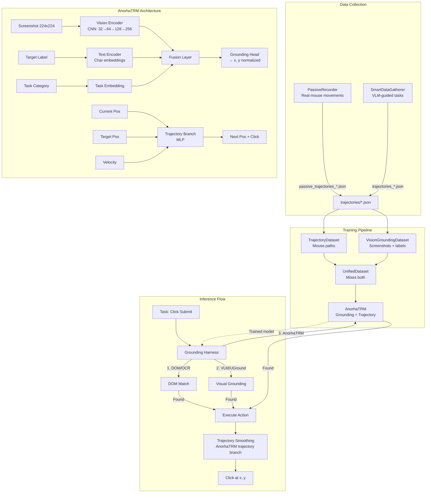

# Anorha-Control

**TRM-based autonomous GUI control with unsupervised exploration**

A vision-based computer control system using a Tiny Recursive Model (TRM) that learns to click, type, and navigate through curiosity-driven exploration.

## Quick Start

```bash
# Install dependencies
uv sync

# Install playwright browser
uv run playwright install chromium

# Test the system
uv run python -m anorha_control.main test
```

## Usage

### Data Collection (Recommended)

**VLM-Guided Data Gathering:**
```bash
# Headless mode (default, recommended)
uv run python -m anorha_control.main gather \
  --save-screenshots \
  --grounding uground

# Visible mode (for debugging)
uv run python -m anorha_control.main gather \
  --visible \
  --save-screenshots \
  --grounding uground
```

**Passive Recording (Background):**
```bash
# Run in background while you work
uv run python -m anorha_control.exploration.passive_recorder --screenshots
```

### Training

**Train TrajectoryTRM:**
```bash
uv run python -m anorha_control.training.trm_training \
  --data-path data/trajectories \
  --epochs 50
```

**Train on Modal (Cloud GPU):**
```bash
uv run modal run anorha_control.training.modal_train \
  --data-path data/trajectories \
  --epochs 100 \
  --gpu T4
```

### Legacy Exploration Commands

**Safe Mode Exploration (Sandboxed Browser):**
```bash
uv run python -m anorha_control.main explore --headless
```

**Live Exploration (Real Mouse Control):**
```bash
uv run python -m anorha_control.main explore
```

**Train on Collected Experiences:**
```bash
uv run python -m anorha_control.main train --epochs 10
```

## Data Collection for TRM Training

Anorha-Control supports two methods for collecting trajectory training data:

### 1. VLM-Guided Data Gathering

Automated data collection using VLM planning and grounding:

```bash
# Via main.py (recommended)
uv run python -m anorha_control.main gather \
  --save-screenshots \
  --grounding uground

# Or directly via module
uv run python -m anorha_control.exploration.smart_data_gatherer \
  --save-screenshots \
  --grounding uground

# Visible mode (for debugging)
uv run python -m anorha_control.main gather \
  --visible \
  --save-screenshots \
  --grounding uground
```

**Modes:**
- **Headless** (default): Browser runs without visible window, faster, less resource usage
- **Visible** (`--visible`): Shows browser window for debugging or monitoring

**Features:**
- Runs scripted tasks (forms, navigation, precision clicking)
- VLM plans actions, grounding harness finds elements
- Records trajectories with screenshots and task labels
- Target: 5,000+ successful trajectories

**Key CLI Options:**
- `--headless` (default): Run browser without visible window
- `--visible`: Show browser window (useful for debugging)
- `--save-screenshots`: Capture screenshots for Vision TRM training
- `--grounding`: Choose grounding method (`vlm`, `uground`, `vision_trm`, `anorha_trm`)
- `--uground-4bit`: Use 4-bit quantization for UGround (saves VRAM)
- `--target`: Number of successful trajectories to collect (default: 5000)

### 2. Passive Recording

Record your real mouse movements during normal computer use:

```bash
# Basic usage (runs in background)
uv run python -m anorha_control.exploration.passive_recorder

# With screenshots for Vision TRM training
uv run python -m anorha_control.exploration.passive_recorder --screenshots

# Custom output directory and sampling rate
uv run python -m anorha_control.exploration.passive_recorder \
  --output-dir data/trajectories \
  --min-interval-ms 16 \
  --screenshots
```

Or in the background using a headless browser

```bash
# Main usage (remove --uground-4bit to use full uground model for better accuracy)
uv run python -m anorha_control.exploration.smart_data_gatherer --save-screenshots --grounding uground --uground-4bit
```

**How it works:**
- Background listener captures mouse positions at ~60Hz (configurable)
- On each click, segments trajectory from previous action
- Applies Savitzky-Golay smoothing (window=31, polyorder=4) to reduce noise
- Quality filter discards trajectories with excessive direction reversals
- Outputs `passive_trajectories_*.json` in TrajectoryData format

**CLI Options:**
- `--output-dir`: Output directory (default: `data/trajectories`)
- `--min-interval-ms`: Sampling interval in milliseconds (default: 16 = ~60Hz)
- `--screenshots`: Capture screenshot at each click for Vision TRM training
- `--no-smooth`: Disable Savitzky-Golay smoothing (not recommended)

**Why passive recording?**
- **Volume**: Collect 800-3,200 trajectories from 4 days of normal use
- **Diversity**: Real human movement patterns vs synthetic easing curves
- **Effort**: Zero - just run it while you work, game, or code
- **Quality**: Research-backed noise reduction (Savitzky-Golay preserves trajectory shape)
- **Complement**: Works alongside VLM-guided data for better coverage

**Expected output:**
- Files: `passive_trajectories_YYYYMMDD_HHMMSS.json`
- Format: Same as `smart_data_gatherer` output (normalized coords, trajectory points)
- Integration: Automatically loaded by `TrajectoryDataset` during training

### Comparison: When to Use Each Method

| Method | Mode | Best For | Effort | Output |
|--------|------|----------|--------|--------|
| **VLM-Guided** | Headless (default) | Automated collection, structured tasks | Set and forget | Trajectories + screenshots + labels |
| **VLM-Guided** | Visible (`--visible`) | Debugging, monitoring progress | Set and watch | Same as headless |
| **Passive Recording** | Background | Real-world diversity, zero effort | Just run it | Trajectories only (screenshots optional) |

**Recommended workflow:**
1. Start with **headless VLM-guided** gathering (main data source)
2. Run **passive recording** in parallel during normal computer use
3. Both output to `data/trajectories/` and are automatically merged during training

Both methods output to `data/trajectories/` and are automatically merged during training.

## Architecture

### System Overview



### Components

**Data Collection:**
- **PassiveRecorder**: Background mouse recording with Savitzky-Golay smoothing
- **SmartDataGatherer**: VLM-guided task execution with grounding harness
- **TaskCurriculum**: Structured task sampling (precision, forms, navigation, etc.)

**Training:**
- **TrajectoryDataset**: Loads mouse trajectory sequences (target → path)
- **VisionGroundingDataset**: Loads screenshot + target_label pairs
- **UnifiedDataset**: Combines both with configurable grounding ratio
- **AnorhaTRM**: Unified model with grounding branch (screenshot → coords) and trajectory branch (path smoothing)

**Models:**
- **AnorhaTRM**: ~1-2M params, grounding + trajectory in one model
- **VisionTRM**: Grounding-only variant (screenshot → coords)
- **TrajectoryTRM**: Trajectory-only variant (path smoothing)

**Inference:**
- **GroundingHarness**: Multi-strategy element finding (DOM → OCR → VLM → AnorhaTRM)
- **ExecutionBackend**: BrowserBackend (Playwright) or DesktopBackend (pyautogui)
- **Trajectory Smoothing**: AnorhaTRM trajectory branch generates smooth mouse paths

## Project Structure

```
anorha_control/
├── models/
│   ├── vision_encoder.py   # Frozen MobileViTv2
│   └── trm.py              # Tiny Recursive Model
├── exploration/
│   ├── async_explorer.py      # Curiosity-driven explorer
│   ├── smart_data_gatherer.py # VLM-guided data collection
│   └── passive_recorder.py    # Background mouse recording
├── training/
│   ├── async_trainer.py    # REINFORCE trainer
│   ├── trm_training.py     # Trajectory TRM training
│   ├── vision_trm_training.py # Vision grounding training
│   └── unified_trm.py     # AnorhaTRM (unified grounding + trajectory)
├── knowledge/
│   └── database.py         # SQLite experience storage
├── utils/
│   ├── screen.py           # mss screen capture
│   ├── mouse.py            # pyautogui with bezier curves
│   ├── browser.py          # Playwright async browser
│   └── hashing.py          # Perceptual hashing
├── config.py               # Configuration
└── main.py                 # CLI entry point
```

## How It Works

1. **Capture**: Screenshot of current screen
2. **Encode**: Vision encoder → 256d embedding
3. **Predict**: TRM predicts (x, y) + action type
4. **Execute**: Click/type/scroll with human-like movement
5. **Observe**: Compute reward (did screen change? new state?)
6. **Learn**: REINFORCE on successful transitions

The explorer uses **curiosity-driven exploration**:
- Random actions with ε probability
- Prioritizes untried UI elements
- Rewards novel states and successful transitions

## Training

### Local Training

Train TrajectoryTRM on collected data:

```bash
uv run python -m anorha_control.training.trm_training \
  --data-path data/trajectories \
  --epochs 50 \
  --batch-size 32
```

### Training on Modal

For larger-scale training, deploy to Modal's GPUs:

```bash
uv run modal run anorha_control.training.modal_train \
  --data-path data/trajectories \
  --epochs 100 \
  --gpu T4
```

Supports T4 (cheapest), L4 (faster), A10G, and A100 GPUs. Training time: ~20-40 minutes for 1k trajectories on T4.

## License

MIT
